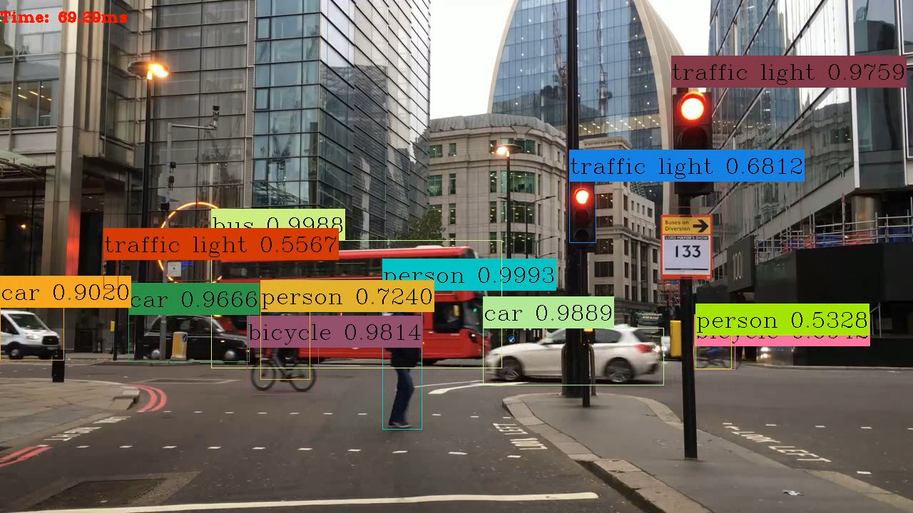

## Average Time Elapsed for process on each frame: 71.6ms 


# YoloV3 Implementation in Tensorflow 2.x

See on YouTube: [4K YoloV3 Object detection using Tensorflow 2.1](https://www.youtube.com/watch?v=2Xc9oj2qMRc)

This repo provide a clean implementation of YoloV3 in Tensorflow 2.x using all the best practices.




## Key Features

- [x] TensorFlow 2.1
- [x] `yolov3` with pre-trained Weights
- [ ] `yolov3-tiny` with pre-trained Weights
- [x] Inference example
- [x] Transfer learning example
- [ ] Eager mode training with `tf.GradientTape`
- [ ] Graph mode training with `model.fit`
- [x] Functional model with `tf.keras.layers`
- [x] Input pipeline using `tf.data`
- [x] Tensorflow Serving
- [ ] Vectorized transformations
- [x] GPU accelerated
- [x] Fully integrated with `absl-py` from [abseil.io](https://abseil.io)
- [x] Clean implementation
- [x] Following the best practices
- [x] MIT License


## Usage

### Installation

#### Pip

```bash
# without GPU
pip install -r requirements.txt
#with GPU
pip install -r requirements-gpu.txt
```

### Nvidia Driver (For GPU)

```bash
# Ubuntu 18.04
sudo apt-add-repository -r ppa:graphics-drivers/ppa
sudo apt install nvidia-driver-440
# Windows/Other
https://www.nvidia.com/Download/index.aspx
```

### Convert pre-trainned Darknet weights

```bash
# yolov3
wget https://pjreddie.com/media/files/yolov3.weights -O data/yolov3.weights
python convert.py --weights ./data/yolov3.weights --output ./checkpoints/yolov3.tf
```

### Detection 

```bash
# WebCam
python object_detected.py --video 0

# Video file
python object_detected.py --video path_to_file.mp4

# Vidoe file with output
python object_detected.py --video path_to_file.mp4 --output ./output.avi
```

### Training 

soon


## Implementation Details


### Loading pre-trained Darknet weights

very hard with pure functional API because the layer ordering is different in
tf.keras and darknet. The clean solution here is creating sub-models in keras.
Keras is not able to save nested model in h5 format properly, TF Checkpoint is
recommended since its offically supported by TensorFlow.

## Command Line Args Reference

```bash
convert.py:
  --output: path to output
    (default: './checkpoints/yolov3.tf')
  --weights: path to weights file
    (default: './data/yolov3.weights')
  --num_classes: number of classes in the model
    (default: '80')
    (an integer)


detect_video.py:
  --classes: path to classes file
    (default: './data/coco.names')
  --video: path to input video (use 0 for cam)
    (default: './data/video.mp4')
  --output: path to output video (remember to set right codec for given format. e.g. XVID for .avi)
    (default: None)
  --output_format: codec used in VideoWriter when saving video to file
    (default: 'XVID')
  --weights: path to weights file
    (default: './checkpoints/yolov3.tf')
  --num_classes: number of classes in the model
    (default: '80')
    (an integer)

```

# Change Log

#### May 25, 2020

- Updated to Tensorflow to v2.1.0 Release


## References

It is pretty much impossible to implement this from the yolov3 paper alone. 

- https://github.com/pjreddie/darknet
    - official yolov3 implementation
- https://github.com/AlexeyAB
    - explinations of parameters
- https://github.com/qqwweee/keras-yolo3
    - models
    - loss functions
- https://github.com/YunYang1994/tensorflow-yolov3
    - data transformations
    - loss functions
- https://github.com/ayooshkathuria/pytorch-yolo-v3
    - models
- https://github.com/broadinstitute/keras-resnet
    - batch normalization fix
- https://github.com/zzh8829/yolov3-tf2
	- tiny
